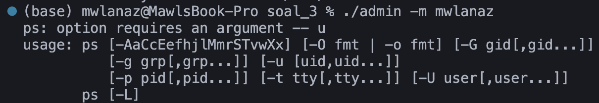
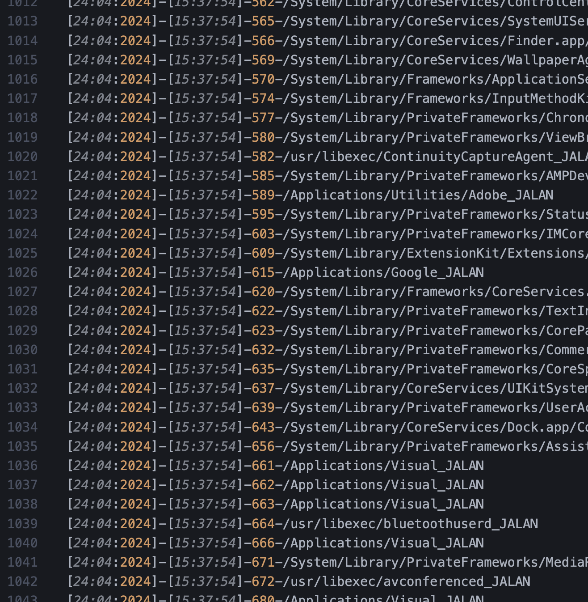

# Laporan Hasil Praktikum Sistem Operasi 2024 Modul 2 - IT02

## Anggota Kelompok IT 02 :

- Maulana Ahmad Zahiri (5027231010)
- Syela Zeruya Tandi Lalong (5027231076)
- Kharisma Fahrun Nisa' (5027231086)

## Daftar Isi

- [Soal 1](#soal-1)
- [Soal 2](#soal-2)
- [Soal 3](#soal-3)
- [Soal 4](#soal-4)

# Soal 1

## Deskripsi Soal

Membuat program yang membantu Gavriel memantau perubahan file.

## Pengerjaan

```c
#include <stdio.h>
#include <stdlib.h>
#include <dirent.h>
#include <sys/types.h>
#include <sys/stat.h>
#include <fcntl.h>
#include <time.h>
#include <string.h>
#include <unistd.h>
#include <errno.h>
#include <syslog.h>
```

Semua pustaka ini digunakan untuk mengelola file, direktori, dan sistem operasi dalam kode ini.

- stdio.h: Menyediakan fungsi dan konstanta untuk input/output.
- stdlib.h: Menyediakan fungsi untuk pengelolaan memori, pengelolaan proses, dan pengelolaan string.
- dirent.h: Menyediakan fungsi untuk mengakses direktori.
- sys/types.h: Menyediakan tipe data yang diperlukan untuk sistem operasi.
- sys/stat.h: Menyediakan fungsi untuk mengakses informasi file dan direktori.
- fcntl.h: Menyediakan fungsi untuk mengontrol file descriptor.
- time.h: Menyediakan fungsi untuk mengelola waktu dan tanggal.
- string.h: Menyediakan fungsi untuk mengelola string.
- unistd.h: Menyediakan fungsi untuk mengakses sistem operasi.
- errno.h: Menyediakan kode error untuk sistem operasi.
- syslog.h: Menyediakan fungsi untuk mengirim log ke sistem operasi.

```c
void makeLog(const char *diredit, char *filename) {
    FILE *log = fopen("/home/vboxuser/Documents/kuman/virus.log", "a");
    time_t rawtime;
    struct tm *timeinfo;
    time(&rawtime);
    timeinfo = localtime(&rawtime);
    char time[100];
    strftime(time, sizeof(time), "[%d-%m-%Y][%H:%M:%S]", timeinfo);
    fprintf(log, "%s String aneh di %s berhasil diganti!\n", time, filename);
    fclose(log);
}
```

Fungsi ini digunakan untuk mencatat setiap penggantian string ke dalam file virus.log, lalu membuka file log dalam mode append ("a"). Setelah itu fungsi ini bekerja untuk mendapatkan waktu saat ini dan mengubahnya menjadi format [dd-mm-YYYY][HH:MM:SS] serta menulis waktu dan informasi penggantian ke dalam file log untuk kemudian menutup file log.

```c
char *editContent(char *str, char *before, char *after) {
    char *pos, *temp;
    int index, before_len;
    int i, count = 0;

    before_len = strlen(before);

    for (i = 0; str[i] != '\0'; i++) {
        if (strstr(&str[i], before) == &str[i]) {
            count++;
            i += before_len - 1;
        }
    }

    temp = (char *)malloc(i + count * (strlen(after) - before_len) + 1);

    i = 0;
    while (*str) {
        if ((pos = strstr(str, before)) == str) {
            strcpy(&temp[i], after);
            i += strlen(after);
            str += before_len;
        } else {
            temp[i++] = *str++;
        }
    }

    temp[i] = '\0';
    return temp;
}
```

Fungsi ini mengambil string asli, string yang akan diganti (before), dan string pengganti (after) kemudian menghitung jumlah kemunculan before dalam str. Lalu fungsi ini akan membuat buffer baru dengan ukuran yang cukup untuk menampung string hasil penggantian. Fungsi ini juga akan mengganti semua kemunculan before dengan after dalam str dan mengembalikan string hasil penggantian.

```c
void editFile(const char *diredit) {
    struct dirent *entry;
    struct stat stat;
    char file_path[1024];
    char buffer[1024];
    char *kontenTelahDiUbah;

    DIR *dir = opendir(diredit);
    if (!dir) return;

    chdir(diredit);
    while((entry = readdir(dir))){
        if(strcmp(entry->d_name, ".") == 0 || strcmp(entry->d_name, "..") == 0) continue;

        if(lstat(entry->d_name, &stat) == -1) continue;

        if(S_ISDIR(stat.st_mode)){
            editFile(entry->d_name);
        }else if(S_ISREG(stat.st_mode)){
            sprintf(file_path, "%s/%s", diredit, entry->d_name);

            FILE *awal = fopen(file_path, "r");
            if (awal != NULL){
                fread(buffer, 1, sizeof(buffer), awal);
                fclose(awal);

                kontenTelahDiUbah = buffer;
                kontenTelahDiUbah = editContent(kontenTelahDiUbah, "m4LwAr3", "[MALWARE]");
                kontenTelahDiUbah = editContent(kontenTelahDiUbah, "5pYw4R3", "[SPYWARE]");
                kontenTelahDiUbah = editContent(kontenTelahDiUbah, "R4nS0mWaR3", "[RANSOMWARE]");

              if (strcmp(buffer, kontenTelahDiUbah) != 0) {
                    awal = fopen(file_path, "w");
                    fputs(kontenTelahDiUbah, awal);
                    fclose(awal);
                    makeLog(diredit, entry->d_name);
                    sleep(15);
              }
            }
        }
    }
  closedir(dir);
}
```

Fungsi ini akan berjalan secara rekursif untuk mencari semua file dalam direktori yang ditentukan dan mengedit konten file tersebut, lalu membuka direktori dengan opendir. Kemudian fungsi akan membaca setiap entri direktori dengan readdir. Jika entri adalah direktori, fungsi memanggil editFile secara rekursif. Jika entri adalah file, maka fungsi akan membaca konten file, mengedit konten dengan editContent, dan menulis kembali ke file jika ada perubahan. Setelah selesai, fungsi akan menutup direktori dengan closedir.

```c
int main(int argc, char *argv[]){

  pid_t pid, sid;

  pid = fork();

  if (pid < 0)
  {
  exit(EXIT_FAILURE);
  }

  if (pid > 0)
  {
  exit(EXIT_SUCCESS);
  }

  umask(0);

  sid = setsid();
  if (sid < 0)
  {
  exit(EXIT_FAILURE);
  }

  if (chdir("/") < 0)
  {
  exit(EXIT_FAILURE);
  }

  close(STDIN_FILENO);
  close(STDOUT_FILENO);
  close(STDERR_FILENO);

  while (1){
  sleep(15);
  editFile(argv[1]);
  }

return 0;
}
```

Program ini dimulai dengan menjadi daemon untuk berjalan di latar belakang dengan menggunakan fork dan setsid untuk menjadi daemon. Selanjutnya program akan engubah direktori kerja ke root (/) dan menutup file descriptor standar. Dalam loop tak terbatas, program menunggu 15 detik, kemudian memanggil editfile untuk mengedit file dalam direktori yang ditentukan oleh argumen baris perintah.
Penggunaan Program:
Program ini dijalankan dari terminal dengan memberikan path direktori sebagai argumen.
Program akan mencari dan mengganti string tertentu dalam semua file di dalam direktori dan subdirektorinya, serta mencatat setiap penggantian ke dalam file virus.log.

## Kesulitan

Kebingungan pada awal percobaan pada virus.log masih ada karakter aneh yang terselip

# Soal 2
## Deskripsi Soal
Paul diminta membuat program manajemen file sederhana dalam bahasa C untuk sistem Linux. Program yang dibuat harus berjalan sebagai daemon dan memiliki beberapa fungsi.

## Pengerjaan
``` c
void decrypt_string(char *str) 
{
    int i = 0;
    while (str[i] != '\0') 
    {
        if (str[i] >= 'a' && str[i] <= 'z') {
            str[i] = ((str[i] - 'a' + 19) % 26) + 'a';
        } else if (str[i] >= 'A' && str[i] <= 'Z') {
            str[i] = ((str[i] - 'A' + 19) % 26) + 'A';
        }
        i++;
    }
}
```
- Fungsi ini menggunakan loop `while` untuk mengakses karakter satu per satu dalam string `str`.
- Setiap karakter huruf kecil ('a' sampai 'z') dan huruf besar ('A' sampai 'Z') akan diubah sesuai dengan algoritma ROT19.
- Hasil dari operasi tersebut akan disimpan kembali pada posisi karakter yang sama dalam string `str`.

```c
void delete_file(char *file) 
{
    if (remove(file) == 0) 
    {
        printf("File %s berhasil dihapus.\n", file);
    } else 
    {
        printf("Gagal menghapus file %s\n", file);
    }
}
```
- Fungsi ini menggunakan fungsi `remove()` untuk menghapus file dengan nama file.
- Jika penghapusan berhasil (`remove()` mengembalikan nilai 0), maka pesan berhasil dicetak.
- Jika terjadi kesalahan, pesan error dicetak.

```c
void log_file_action(char *username, char *file, char *action) 
{
    FILE *logFile = fopen("history.log", "a");
    if (logFile == NULL) 
    {
        perror("Error membuka file log");
        exit(EXIT_FAILURE);
    }
    time_t rawtime;
    struct tm *timeinfo;
    char timestamp[20];
    time(&rawtime);
    timeinfo = localtime(&rawtime);
    strftime(timestamp, sizeof(timestamp), "%H:%M:%S", timeinfo);
    fprintf(logFile, "[%s][%s] - %s - %s\n", username, timestamp, file, action);
    fclose(logFile);
}
```
- Fungsi membuka file log (`history.log`) dalam mode append ("a").
- Jika gagal membuka file log, program akan keluar dengan status `EXIT_FAILURE`.
- Fungsi menggunakan waktu lokal untuk mendapatkan timestamp.
- Tindakan (action) beserta informasi pengguna (username), nama file, dan timestamp dicatat ke dalam file log.
- File log ditutup setelah selesai mencatat.

```c
void process_directory_files() 
{
    DIR *dir;
    struct dirent *entry;
    dir = opendir("library/");
    if (dir == NULL) 
    {
        perror("Error membuka direktori");
        exit(EXIT_FAILURE);
    }

    while ((entry = readdir(dir)) != NULL) 
    {
        if (entry->d_type == DT_REG) 
        { 
            char *file = entry->d_name;
            char deskripsi_file[256];

            strcpy(deskripsi_file, file);
            decrypt_string(deskripsi_file);

            if (strstr(deskripsi_file, "d3Let3") != NULL) 
            {
                delete_file(file);
            } else if (strstr(deskripsi_file, "r3N4mE") != NULL) 
            {
                char *file_ext = strrchr(file, '.');
                if (file_ext != NULL) {
                    if (strcmp(file_ext, ".ts") == 0) 
                    {
                        rename(file, "helper.ts");
                    } else if (strcmp(file_ext, ".py") == 0)
                    {
                        rename(file, "calculator.py");
                    } else if (strcmp(file_ext, ".go") == 0) 
                    {
                        rename(file, "server.go");
                    } else
                    {
                        rename(file, "renamed.file");
                    }
                }
            }
        }
    }
    closedir(dir);
}

void perform_backup() 
{
    DIR *dir;
    struct dirent *entry;
    dir = opendir("library/"); 
    if (dir == NULL) 
    {
        perror("Error membuka direktori");
        exit(EXIT_FAILURE);
    }

    while ((entry = readdir(dir)) != NULL) 
    {
        if (entry->d_type == DT_REG) 
        { 
            char *file = entry->d_name;
            char deskripsi_file[256];
            strcpy(deskripsi_file, file);
            decrypt_string(deskripsi_file);

            if (strstr(deskripsi_file, "m0V3") != NULL) 
            {
                char backup[256];
                sprintf(backup, "backup/%s", file);
                rename(file, backup);
                log_file_action("paul", file, "Berhasil dipindahkan ke backup.");
            }
        }
    }

    closedir(dir);
}

void restore_backup_files() 
{
    DIR *dir;
    struct dirent *entry;
    dir = opendir("library/backup/");
    if (dir == NULL) 
    {
        perror("Error membuka direktori");
        exit(EXIT_FAILURE);
    }

    while ((entry = readdir(dir)) != NULL) 
    {
        if (entry->d_type == DT_REG) 
        { 
            char *file = entry->d_name;
            char deskripsi_file[256];
            strcpy(deskripsi_file, file);
            decrypt_string(deskripsi_file);
            char restored_path[256];
            sprintf(restored_path, "%s", file);
            char backup[256];
            sprintf(backup, "backup/%s", file);
            rename(backup, restored_path);
            log_file_action("paul", file, "Berhasil dipulihkan dari backup.");
        }
    }
    closedir(dir);
}
```
- `process_directory_files()`: Mengelola file dalam direktori 'library' dengan melakukan dekripsi nama file dan melakukan operasi rename atau delete berdasarkan pola nama file.
- `perform_backup()`: Memindahkan file dengan pola nama tertentu ke folder 'backup' dan mencatat tindakan tersebut ke dalam log.
- `restore_backup_files()`: Mengembalikan file dari folder 'backup' ke direktori asalnya dalam 'library' dan mencatat tindakan tersebut ke dalam log.

```c
void handle_signals(int signum) 
{
    char *mode;
    if (signum == SIGRTMIN) 
    {
        mode = "default";
    } else if (signum == SIGUSR1) 
    {
        mode = "backup";
        perform_backup(); 
    } else if (signum == SIGUSR2) 
    {
        mode = "restore";
        restore_backup_files(); 
    }
    log_file_action("daemon", "daemon", mode);
}
```
- Fungsi ini menangani sinyal yang diterima oleh proses untuk mengubah mode program (default, backup, atau restore).
- Bergantung pada sinyal yang diterima (SIGRTMIN, SIGUSR1, SIGUSR2), fungsi ini memanggil fungsi perform_backup() atau restore_backup_files() sesuai dengan mode yang dipilih.
- Setelah menangani sinyal, fungsi mencatat tindakan ke dalam log.

```c
int main() 
{
    // Proses pertama: Download file library.zip dari URL yang ditentukan menggunakan wget
    pid_t pid = fork();
    if (pid < 0) {
        perror("Error saat melakukan fork");
        exit(EXIT_FAILURE);
    } else if (pid == 0) 
    {
        char *download_link = "https://drive.google.com/uc?export=download&id=1rUIZmp10lXLtCIH3LAZJzRPeRks3Crup";
        char *zip_file = "library.zip";
        execlp("wget", "wget", "-O", zip_file, download_link, NULL);
        perror("Error menjalankan wget");
        exit(EXIT_FAILURE);
    } else 
    {
        int status;
        waitpid(pid, &status, 0);
        if (WIFEXITED(status) && WEXITSTATUS(status) == 0) {
            printf("Download berhasil.\n");
        } else 
        {
            printf("Download gagal.\n");
            exit(EXIT_FAILURE);
        }
    }

    // Proses kedua: Ekstraksi library.zip ke direktori 'library' menggunakan unzip
    pid = fork();
    if (pid < 0) 
    {
        perror("Error saat melakukan fork");
        exit(EXIT_FAILURE);
    } 
    else if (pid == 0) 
    {
        execlp("unzip", "unzip", "library.zip", "-d", "library/", NULL);
        perror("Error menjalankan unzip");
        exit(EXIT_FAILURE);
    } 
    else 
    {
        int status;
        waitpid(pid, &status, 0);
        if (WIFEXITED(status) && WEXITSTATUS(status) == 0) 
        {
            printf("Ekstraksi berhasil.\n");
        } 
        else 
        {
            printf("Ekstraksi gagal.\n");
            exit(EXIT_FAILURE);
        }
    }

```
1. Pemanggilan fork()
    - Proses utama memanggil `fork()` untuk membuat proses baru.
    - Jika gagal (`pid < 0`), pesan kesalahan dicetak dan program keluar.
2. Child Process (pid == 0)
    - Child process menjalankan perintah `wget` untuk mengunduh file `library.zip` dari URL tertentu.
    - Jika gagal (`execlp()` mengembalikan nilai), pesan kesalahan dicetak dan child process keluar.
3. Parent Process (pid > 0)
    - Parent process menunggu child process selesai menggunakan `waitpid()`.
    - Jika child process berhasil (`WIFEXITED(status)` dan `WEXITSTATUS(status) == 0`), pesan "Download berhasil" dicetak.
    - Jika child process gagal, pesan "Download gagal" dicetak.

```c
process_directory_files();
```
Fungsi `process_directory_files()` dipanggil untuk melakukan pemrosesan terhadap file-file yang ada dalam direktori 'library'. Dalam fungsi ini, setiap file akan dicek untuk melakukan dekripsi nama file dan aksi berdasarkan kodenya (seperti rename atau hapus), sesuai dengan aturan yang telah dijelaskan sebelumnya.

```c
signal(SIGRTMIN, handle_signals); 
signal(SIGUSR1, handle_signals); 
signal(SIGUSR2, handle_signals); 
```
Kode di atas menetapkan penanganan sinyal untuk tindakan backup dan restore dengan menggunakan fungsi `handle_signals()`. Ketika program menerima sinyal `SIGRTMIN` (dari `kill -SIGRTMIN <pid_program>`), `SIGUSR1` (dari `kill -SIGUSR1 <pid_program>`), atau SIGUSR2 (dari `kill -SIGUSR2 <pid_program>`), maka fungsi `handle_signals()` akan dipanggil sesuai dengan sinyal yang diterima.

## Revisi

# Soal 3

## Deskripsi Soal

Pak Heze adalah seorang admin yang baik. Beliau ingin membuat sebuah program admin yang dapat memantau para pengguna sistemnya. Bantulah Pak Heze untuk membuat program tersebut!

## Pengerjaan

```c
#include <stdio.h>
#include <string.h>
#include <stdlib.h>
#include <unistd.h>
#include <sys/types.h>
#include <sys/stat.h>
#include <fcntl.h>
#include <dirent.h>
#include <signal.h>
#include <sys/wait.h>
#include <pwd.h>
#include <time.h>

```

keterangan :
File ini berisi header yang diperlukan untuk melakukan operasi I/O, manajemen proses, dan manipulasi string dalam bahasa pemrograman C.
stdio.h: Header untuk fungsi standar input-output, termasuk fungsi printf dan scanf.

- string.h: Header untuk fungsi pemrosesan string seperti strcpy, strcat, dan lainnya.
- stdlib.h: Header untuk fungsi umum seperti alokasi memori (malloc), konversi string menjadi angka (atoi), dan fungsi-fungsi lain yang terkait dengan alokasi memori dan manipulasi data.
- unistd.h: Header untuk fungsi-fungsi sistem POSIX seperti fork, exec, dan lainnya.
- sys/types.h: Header yang mendefinisikan tipe data dasar yang digunakan dalam pemrograman sistem, seperti pid_t (untuk ID proses) dan mode_t (untuk mode izin file).
- sys/stat.h: Header untuk fungsi-fungsi yang berkaitan dengan informasi status file, seperti stat dan chmod.
- fcntl.h: Header untuk operasi-operasi file terkait pengendalian akses file dan deskriptor file.
- dirent.h: Header untuk manipulasi direktori seperti membaca isi direktori dengan fungsi opendir dan readdir.
- signal.h: Header untuk menangani sinyal-sinyal yang dikirim ke proses, dengan fungsi-fungsi seperti signal dan kill.
- sys/wait.h: Header yang berisi deklarasi fungsi-fungsi untuk menunggu proses anak selesai dan mendapatkan statusnya.
- pwd.h: Header untuk mendapatkan informasi tentang pengguna saat ini, dengan fungsi seperti getpwuid.
- time.h: Header untuk fungsi-fungsi terkait waktu, seperti time dan localtime.

```c
// Fungsi untuk menampilkan bantuan
void show_help() {
    printf("Usage: ./admin <option> <user>\n");
    printf("Options:\n");
    printf(" -m <user>   Monitor processes for the specified user\n");
    printf(" -s         Stop monitoring processes\n");
    printf(" -c <user>  Continuously fail processes for the specified user\n");
    printf(" -a <user>  Allow processes for the specified user\n");
```

Ini adalah fungsi show_help() yang memberikan panduan penggunaan program. Di sini, program dijelaskan cara menggunakan program admin, termasuk opsi yang tersedia dan argumen yang diperlukan.

Options:

- -m <user>: Memantau proses untuk pengguna tertentu.
- -s: Menghentikan pemantauan proses.
- -c <user>: Terus gagalkan proses untuk pengguna tertentu secara berkelanjutan.
- -a <user>: Memperbolehkan proses untuk pengguna tertentu.

## fungsi menulis ke file log dan memonitornya

```c
void monitorProcesses(const char *user) {
    struct passwd *pwd = getpwnam(user);
    if (pwd == NULL) {
        perror("Failed to get user information");
        exit(EXIT_FAILURE);
    }
    uid_t uid = pwd->pw_uid;

    char log_filename[MAX_LINE_LENGTH];
    snprintf(log_filename, sizeof(log_filename), "%s.log", user);
    FILE *log_file = fopen(log_filename, "a");
    if (log_file == NULL) {
        perror("Failed to open log file");
        exit(EXIT_FAILURE);
    }

    DIR *dir = opendir("/proc");
    if (dir == NULL) {
        perror("Failed to open /proc directory");
        exit(EXIT_FAILURE);
    }

    struct dirent *entry;
    while ((entry = readdir(dir)) != NULL) {
        char filename[MAX_LINE_LENGTH];
        snprintf(filename, sizeof(filename), "/proc/%s/status", entry->d_name);
        FILE *status_file = fopen(filename, "r");
        if (status_file != NULL) {
            char line[MAX_LINE_LENGTH];
            uid_t uid_process = 0;
            while (fgets(line, sizeof(line), status_file)) {
                if (strncmp(line, "Uid:", 4) == 0) {
                    sscanf(line + 4, "%u", &uid_process);
                    break;
                }
            }
            fclose(status_file);
            if (uid_process == uid) {
                fprintf(log_file, "%s\n", entry->d_name);
            }
        }
    }

    closedir(dir);
    fclose(log_file);
}
```

Perintah ps digunakan untuk mendapatkan daftar proses untuk pengguna tertentu.
Setiap baris output dari ps diproses untuk mendapatkan PID proses dan nama prosesnya.

Pendekatan yang diambil adalah dengan menggunakan direktori `/proc` untuk mengakses informasi status dari setiap proses yang sedang berjalan.

Setelah memperoleh informasi status, kode akan memeriksa ID pengguna dari setiap proses dan mencocokkannya dengan ID pengguna yang ditentukan.

Proses-proses yang sesuai akan dicatat dalam sebuah file log yang bernama user.log, di mana user adalah nama pengguna yang sedang dimonitoring

## run as daemon

```c
void run_as_daemon() {
    pid_t pid = fork();
    if (pid < 0) {
        perror("fork failed");
        exit(EXIT_FAILURE);
    }
    if (pid > 0) {
        exit(EXIT_SUCCESS);
    }
    if (setsid() < 0) {
        perror("setsid failed");
        exit(EXIT_FAILURE);
    }
    int fd = open("/dev/null", O_RDWR);
    dup2(fd, STDIN_FILENO);
    dup2(fd, STDOUT_FILENO);
    dup2(fd, STDERR_FILENO);
    close(fd);
}
```

Fungsi run_as_daemon membuat program berjalan sebagai daemon dengan cara melakukan fork untuk menciptakan proses anak, kemudian proses induk keluar agar hanya proses anak yang berjalan.

Proses anak kemudian menjadi pemimpin sesi baru dengan `setsid()`, yang memisahkan proses dari terminal kontrolnya.

Selain itu, fungsi ini menutup file descriptor yang terhubung ke terminal dan mengalihkan stdin, stdout, dan stderr ke `/dev/null` untuk membuang input/output, sehingga menjadikan program berjalan sebagai background process yang independen.

## Fail Process

```c
void fail_processes(char *user) {
    DIR *dir;
    struct dirent *entry;
    char path[256];

    dir = opendir("/proc");
    if (!dir) {
        perror("opendir failed");
        return;
    }

    while ((entry = readdir(dir)) != NULL) {
        if (entry->d_type == DT_DIR) {
            sprintf(path, "/proc/%s/status", entry->d_name);
            FILE *status = fopen(path, "r");
            if (status) {
                char line[256];
                char username[256];
                int uid;
                while (fgets(line, sizeof(line), status)) {
                    if (strncmp(line, "Uid:", 4) == 0) {
                        sscanf(line, "Uid: %d", &uid);
                        struct passwd *pwd = getpwuid(uid);
                        if (pwd != NULL) {
                            strcpy(username, pwd->pw_name);
                            if (strcmp(username, user) == 0) {
                                // Mengirim sinyal SIGKILL ke proses
                                kill(atoi(entry->d_name), SIGKILL);
                            }
                        }
                    }
                }
                fclose(status);
            }
        }
    }
    closedir(dir);
}
```

- Fungsi fail_processes digunakan untuk menggagalkan (fail) proses yang dimiliki oleh pengguna tertentu.
- fungsi membuka direktori /proc yang berisi informasi tentang proses yang sedang berjalan di sistem.
- Setiap entri dalam direktori tersebut mewakili satu proses.
- Selama masih ada entri dalam direktori /proc, fungsi membaca setiap entri dan membuka file /proc/[pid]/status untuk mendapatkan informasi tentang pengguna yang menjalankan proses tersebut.
- Jika informasi pengguna ditemukan, fungsi menggunakan getpwuid untuk mendapatkan nama pengguna dari ID pengguna (UID).
- Jika nama pengguna proses sesuai dengan pengguna yang diberikan sebagai argumen, fungsi mengirimkan sinyal SIGKILL ke proses tersebut menggunakan kill(atoi(entry->d_name), SIGKILL).
- Sinyal SIGKILL digunakan untuk menghentikan secara paksa proses yang dianggap tidak dapat dipulihkan.
- Setelah selesai membaca semua entri dalam direktori /proc, direktori tersebut ditutup.
- Dengan cara ini, fungsi fail_processes memungkinkan proses-proses yang dimiliki oleh pengguna yang ditentukan untuk gagal secara paksa.

## Allow Process

```c
void allow_processes(char *user) {
    DIR *dir;
    struct dirent *entry;
    char path[256];

    dir = opendir("/proc");
    if (!dir) {
        perror("opendir failed");
        return;
    }

    while ((entry = readdir(dir)) != NULL) {
        if (entry->d_type == DT_DIR) {
            sprintf(path, "/proc/%s/status", entry->d_name);
            FILE *status = fopen(path, "r");
            if (status) {
                char line[256];
                char username[256];
                int uid;
                while (fgets(line, sizeof(line), status)) {
                    if (strncmp(line, "Uid:", 4) == 0) {
                        sscanf(line, "Uid: %d", &uid);
                        struct passwd *pwd = getpwuid(uid);
                        if (pwd != NULL) {
                            strcpy(username, pwd->pw_name);
                            if (strcmp(username, user) == 0) {
                                // Mengirim sinyal SIGCONT untuk melanjutkan proses
                                kill(atoi(entry->d_name), SIGCONT);
                            }
                        }
                    }
                }
                fclose(status);
            }
        }
    }
    closedir(dir);
}
```

Fungsi `allow_processes` membuka direktori `/proc`, yang berisi informasi tentang proses yang sedang berjalan di sistem. Setiap entri dalam direktori tersebut mewakili satu proses. Selama masih ada entri dalam direktori /proc, fungsi membaca setiap entri dan membuka file `/proc/[pid]/status` untuk mendapatkan informasi tentang pengguna yang menjalankan proses tersebut.

Jika informasi pengguna ditemukan, fungsi menggunakan getpwuid untuk mendapatkan nama pengguna dari ID pengguna `(UID)`. Jika nama pengguna proses sesuai dengan pengguna yang diberikan sebagai argumen, fungsi mengirimkan sinyal `SIGCONT` ke proses tersebut menggunakan kill(atoi(entry->d_name), SIGCONT). Sinyal SIGCONT digunakan untuk melanjutkan proses yang mungkin telah dihentikan sebelumnya.

Setelah selesai membaca semua entri dalam direktori /proc, direktori tersebut ditutup. Dengan cara ini, fungsi allow_processes memungkinkan proses-proses yang dimiliki oleh pengguna yang ditentukan untuk dilanjutkan kembali setelah mungkin dihentikan sebelumnya.

## Fungsi Main

```c
// Fungsi utama
int main(int argc, char *argv[]) {
    if (argc < 2) {
        show_help();
        return 1;
    }

    char *option = argv[1];

     if (argc == 2) {
        // opsi -u
        char user_option[20];
        sprintf(user_option, "-u%s", argv[1]);

        // Menjalankan perintah `ps -u <option>` kata lain ./admin <user>
        if (execlp("ps", "ps", user_option, NULL) == -1) {
            perror("execlp failed");
            return 1;
        }
    }

    if (strcmp(option, "-m") == 0 || strcmp(option, "-s") == 0 || strcmp(option, "-c") == 0 || strcmp(option, "-a") == 0) {
        if (argc < 3 && strcmp(option, "-s") != 0) { // Tidak memerlukan argumen pengguna untuk opsi -s
            printf("Error: Missing user argument for option %s\n", option);
            show_help();
            return 1;
        }

        char *user = argc >= 3 ? argv[2] : "";

         if (strcmp(option, "-m") == 0) {
            // Memantau proses pengguna yang diberikan
            log_file = fopen("file.log", "a");
            if (!log_file) {
                perror("Error opening log file");
                return 1;
            }
            monitor_processes(user);
            fclose(log_file);
        } else if (strcmp(option, "-s") == 0) {
            // Menghentikan pemantauan dengan mengirim sinyal SIGKILL ke program admin
            if (log_file != NULL) {
                fclose(log_file);
            }
            return 0; // Keluar dari program
        } else if (strcmp(option, "-c") == 0) {
            // Menggagalkan proses untuk pengguna yang diberikan
            fail_processes(user);
        } else if (strcmp(option, "-a") == 0) {
            // Mengizinkan proses untuk pengguna yang diberikan
            allow_processes(user);
        }
    } else {
        printf("Error: Invalid option %s\n", option);
        show_help();
        return 1;
    }

    return 0;
}
```

maksud secara pemanggilan dalam fungsi main tersebut yakni :

- if (argc < 2) { show_help(); return 1; }: Jika jumlah argumen kurang dari 2, tampilkan bantuan dan keluar dengan kode kesalahan.
  char \*option = argv[1];: Menyimpan opsi dari argumen baris perintah.
- if (argc == 2) { ... }: Jika jumlah argumen adalah 2, lakukan operasi khusus sesuai dengan opsi -u.
  char user_option[20]; sprintf(user_option, "-u%s", argv[1]);: Buat opsi pengguna untuk perintah ps.
- if (execlp("ps", "ps", user_option, NULL) == -1) { perror("execlp failed"); return 1; }: Jalankan perintah ps -u <user> menggunakan execlp, jika gagal, tampilkan pesan kesalahan.
- if (strcmp(option, "-m") == 0 || strcmp(option, "-s") == 0 || strcmp(option, "-c") == 0 || strcmp(option, "-a") == 0) { ... }: Periksa apakah opsi valid.
- if (argc < 3 && strcmp(option, "-s") != 0) { ... }: Periksa apakah argumen pengguna diperlukan untuk opsi tertentu.
  char \*user = argc >= 3 ? argv[2] : "";: Simpan nama pengguna dari argumen baris perintah.
- if (strcmp(option, "-m") == 0) { ... } else if (strcmp(option, "-s") == 0) { ... } else if (strcmp(option, "-c") == 0) { ... } else if (strcmp(option, "-a") == 0) { ... }: Lakukan operasi yang sesuai sesuai dengan opsi yang diberikan.
- printf("Error: Invalid option %s\n", option); show_help(); return 1;: Tampilkan pesan kesalahan jika opsi tidak valid dan keluar dengan kode kesalahan.

## contoh error saat menjalankan program

- 
  error saat memasukkan option dikarenakan <'option'> belum terbaca dengan baik oleh fungsi dan belum ditampilkan oleh fungsi main

## Revisi

sebelumnya terdapat beberapa kesalahan saat akan melaksanakan eksekusi ./admin <'option'> <'user'> sehingga dilakukan perbaikan pada proses pemonitoran :

```c
    while (fgets(line, sizeof(line), ps_output) != NULL) {
        if (sscanf(line, "%d", &pid_process) != 1) {
            fprintf(stderr, "sukses menjalankan: %s", line);
            continue;
        }

        time_t now;
        struct tm *local_time;
        char timestamp[30];
        time(&now);
        local_time = localtime(&now);
        strftime(timestamp, sizeof(timestamp), "[%d:%m:%Y]-[%H:%M:%S]", local_time);

        fprintf(log_file, "%s-%d-%s_JALAN\n", timestamp, pid_process, line);
    }

```

sehingga saat dilakukan
`(monitor proccess)` maka :


- memasukkkan command `./admin -m mwlanaz` untuk melakukan monitoring
- memasukkkan command `./admin -s mwlanaz` untuk memberhentikan monitoring


program saat memulai monitoring pada ./admin -m mwlanaz pada user mwlanaz, kemudian berhenti saat ./admin -s mwlanaz

kemudian pada soal selanjutnya yakni :

```c
    while (fgets(line, sizeof(line), ps_output) != NULL) {
        if (sscanf(line, "%d", &pid_process) != 1) {
            fprintf(stderr, "gagal menjalankan: %s", line);
            continue;
        }
        time_t now;
        struct tm *local_time;
        char timestamp[30];
        time(&now);
        local_time = localtime(&now);
        strftime(timestamp, sizeof(timestamp), "[%d:%m:%Y]-[%H:%M:%S]", local_time);

        fprintf(log_file, "%s-%d-%s_GAGAL\n", timestamp, pid_process, line);
    }
```


- memasukkkan command `./admin -c mwlanaz` untuk melakukan monitoring GAGAL
- memasukkkan command `./admin -a mwlanaz` untuk memberhentikan monitoring GAGAL


dari gambar tersebut dapat dilihat jika di log dalam point c maka akan terlihat program menampilkan output GAGAL

## Soal 4

## Deskripsi Soal

Salomo memiliki passion yang sangat dalam di bidang sistem operasi. Saat ini, dia ingin mengotomasi kegiatan-kegiatan yang ia lakukan agar dapat bekerja secara efisien. Bantulah Salomo untuk membuat program yang dapat mengotomasi kegiatan dia!

## Pengerjaan

```c
#include <stdio.h>
#include <stdlib.h>
#include <string.h>
#include <unistd.h>
#include <signal.h>

#define MAX_APPS 10
#define MAX_NAME_LENGTH 20

// Variabel global untuk menyimpan PID dari setiap proses yang dijalankan
pid_t app_pids[MAX_APPS];
char app_names[MAX_APPS][MAX_NAME_LENGTH]; // Menyimpan nama aplikasi yang dijalankan
int num_apps_running = 0;
```

#include <stdio.h>: Mendefinisikan standar input-output, memungkinkan program untuk melakukan operasi masukan dan keluaran.

#include <stdlib.h>: Memberikan akses ke fungsi-fungsi standar untuk alokasi memori, konversi tipe data, dan fungsi-fungsi utilitas lainnya.

#include <string.h>: Memungkinkan manipulasi string, seperti menggabungkan, menyalin, dan membandingkan string.

#include <unistd.h>: Menyediakan akses ke fungsi-fungsi sistem POSIX, termasuk fungsi-fungsi yang berhubungan dengan proses, direktori, dan pengaturan lingkungan.

#include <signal.h>: Memungkinkan penanganan sinyal, seperti SIGKILL, SIGTERM, dan lainnya.

#`define MAX_APPS 10`: Mendefinisikan konstanta MAX_APPS dengan nilai 10, yang merupakan jumlah maksimum aplikasi yang dapat dijalankan dalam program.

#`define MAX_NAME_LENGTH 20`: Mendefinisikan konstanta MAX_NAME_LENGTH dengan nilai 20, yang merupakan panjang maksimum nama aplikasi yang dapat disimpan dalam array.

## Membuka Aplikasi Berdasarkan Argumen

```c
void open_apps_from_args(int argc, char *argv[]) {
    // Mulai dari argumen kedua, karena argumen pertama adalah nama program itu sendiri
    for (int i = 1; i < argc; i++) {
        if (strcmp(argv[i], "-o") == 0) {
            // Jika argumen adalah "-o", kita membaca nama aplikasi dan jumlah jendela yang diinginkan
            char *app_name = argv[++i];
            int num_windows = atoi(argv[++i]);

            // Implementasi membuka aplikasi sesuai dengan argumen di sini
            // Misalnya, Anda dapat menggunakan fork() dan exec() untuk menjalankan aplikasi
            // di bawah ini hanyalah contoh sederhana
            for (int j = 0; j < num_windows; j++) {
                pid_t pid = fork();
                if (pid == 0) {
                    execlp(app_name, app_name, NULL);
                    // Jika execlp() gagal, cetak pesan kesalahan
                    perror("exec");
                    _exit(1);
                } else if (pid < 0) {
                    // Jika fork() gagal, cetak pesan kesalahan
                    perror("fork");
                } else {
                    // Simpan PID dan nama aplikasi dari proses yang dijalankan
                    app_pids[num_apps_running] = pid;
                    strcpy(app_names[num_apps_running], app_name);
                    num_apps_running++;
                }
            }
        }
    }
}
```

Fungsi ini membuka aplikasi berdasarkan argumen yang diberikan saat menjalankan program. Jika argumen adalah "-o", program akan membaca nama aplikasi dan jumlah jendela yang diinginkan, lalu menjalankan aplikasi tersebut dalam loop.

Fungsi `open_apps_from_args` digunakan untuk membuka aplikasi berdasarkan argumen yang diberikan dari baris perintah. Dalam iterasi melalui argumen, jika ditemukan argumen `"-o"`, fungsi akan membaca nama aplikasi dan jumlah jendela yang diinginkan.

Selanjutnya, fungsi akan menggunakan `fork()` untuk membuat proses baru dan `execlp()` untuk menjalankan aplikasi tersebut. Setiap proses anak yang berhasil dijalankan akan menyimpan PID dan nama aplikasi untuk referensi selanjutnya, sementara pesan kesalahan akan dicetak jika terjadi masalah dalam pembuatan proses anak atau eksekusi aplikasi.

## Membuka Aplikasi Berdasarkan Konfigurasi

```c
void open_apps_from_config(const char *filename) {
    FILE *file = fopen(filename, "r");
    if (file == NULL) {
        perror("Error opening file");
        return;
    }

    char app_name[MAX_NAME_LENGTH];
    int num_windows;

    while (fscanf(file, "%s %d", app_name, &num_windows) == 2) {
        // Implementasi membuka aplikasi sesuai dengan konfigurasi di sini
        // Misalnya, Anda dapat menggunakan fork() dan exec() untuk menjalankan aplikasi
        // di bawah ini hanyalah contoh sederhana
        for (int j = 0; j < num_windows; j++) {
            pid_t pid = fork();
            if (pid == 0) {
                execlp(app_name, app_name, NULL);
                // Jika execlp() gagal, cetak pesan kesalahan
                perror("exec");
                _exit(1);
            } else if (pid < 0) {
                // Jika fork() gagal, cetak pesan kesalahan
                perror("fork");
            } else {
                // Simpan PID dan nama aplikasi dari proses yang dijalankan
                app_pids[num_apps_running] = pid;
                strcpy(app_names[num_apps_running], app_name);
                num_apps_running++;
            }
        }
    }

    fclose(file);
}
```

Fungsi ini membuka aplikasi berdasarkan konfigurasi yang tersimpan dalam sebuah file. Program membaca nama aplikasi dan jumlah jendela dari file konfigurasi, lalu menjalankan aplikasi tersebut dalam loop.

## Menghentikan Aplikasi

```c
void kill_all_apps() {
    for (int i = 0; i < num_apps_running; i++) {
        kill(app_pids[i], SIGKILL);
    }
    num_apps_running = 0;
}
```

Fungsi ini menghentikan semua aplikasi yang sedang berjalan dengan mengirimkan sinyal SIGKILL ke setiap proses.

## Menghentikan Aplikasi Berdasarkan Konfigurasi

```c
void kill_apps_from_config(const char *filename) {
    FILE *file = fopen(filename, "r");
    if (file == NULL) {
        perror("Error opening file");
        return;
    }

    char app_name[MAX_NAME_LENGTH];
    int num_windows;

    while (fscanf(file, "%s %d", app_name, &num_windows) == 2) {
        // Cari PID dari proses yang sesuai dengan konfigurasi dan kirim sinyal SIGKILL
        for (int i = 0; i < num_apps_running; i++) {
            // Bandingkan nama aplikasi dengan nama aplikasi yang dijalankan
            // dan kirim sinyal SIGKILL jika cocok
            if (strcmp(app_name, app_names[i]) == 0) {
                kill(app_pids[i], SIGKILL);
                break;
            }
        }
    }

    fclose(file);
}
```

Fungsi ini menghentikan aplikasi berdasarkan konfigurasi yang tersimpan dalam sebuah file. Program mencocokkan nama aplikasi yang dijalankan dengan nama aplikasi dalam file konfigurasi, lalu mengirimkan sinyal SIGKILL ke proses yang sesuai.

## Fungsi Main

```c
int main(int argc, char *argv[]) {
    if (argc < 2) {
        printf("Usage: %s -o <app1> <num1> -o <app2> <num2> ... \n", argv[0]);
        printf("       %s -f <filename>\n", argv[0]);
        printf("       %s -k\n", argv[0]);
        printf("       %s -k <filename>\n", argv[0]);
        return 1;
    }

    if (strcmp(argv[1], "-o") == 0) {
        open_apps_from_args(argc, argv);
    } else if (strcmp(argv[1], "-f") == 0) {
        const char *filename = argv[2];
        open_apps_from_config(filename);
    } else if (strcmp(argv[1], "-k") == 0) {
        if (argc == 2) {
            kill_all_apps();
        } else {
            const char *filename = argv[2];
            kill_apps_from_config(filename);
        }
    } else {
        printf("Invalid command.\n");
        return 1;
    }

    return 0;
}
```

Fungsi utama program. Program membaca argumen dari baris perintah dan menjalankan fungsi yang sesuai berdasarkan argumen yang diberikan.

## kasus error


kasus error dimana beberapa aplikasi tidak dapat terbuka dan terjadi error

## Revisi

```c
void open_apps_from_args(int argc, char *argv[]) {
    // Mulai dari argumen kedua, karena argumen pertama adalah nama program itu sendiri
    for (int i = 1; i < argc; i++) {
        if (strcmp(argv[i], "-o") == 0 && i + 2 < argc) {
            // Jika argumen adalah "-o" dan terdapat cukup argumen untuk nama aplikasi dan jumlah jendela
            char *app_name = argv[++i];
            int num_windows = atoi(argv[++i]);

            // Validasi nama aplikasi
            if (access(app_name, F_OK) != -1) {
                // Implementasi membuka aplikasi sesuai dengan argumen di sini
                // Misalnya, Anda dapat menggunakan fork() dan exec() untuk menjalankan aplikasi
                // di bawah ini hanyalah contoh sederhana
                for (int j = 0; j < num_windows; j++) {
                    pid_t pid = fork();
                    if (pid == 0) {
                        execlp(app_name, app_name, NULL);
                        // Jika execlp() gagal, cetak pesan kesalahan
                        perror("exec");
                        _exit(1);
                    } else if (pid < 0) {
                        // Jika fork() gagal, cetak pesan kesalahan
                        perror("fork");
                    } else {
                        // Simpan PID dan nama aplikasi dari proses yang dijalankan
                        app_pids[num_apps_running] = pid;
                        strcpy(app_names[num_apps_running], app_name);
                        num_apps_running++;
                    }
                }
            } else {
                fprintf(stderr, "Error: Aplikasi '%s' tidak ditemukan.\n", app_name);
            }
        } else {
            fprintf(stderr, "Usage: %s -o <app1> <num1> -o <app2> <num2> ...\n", argv[0]);
            return;
        }
    }
}

```

Dalam revisi di atas, saya menambahkan validasi untuk memeriksa apakah aplikasi yang akan dijalankan ada atau tidak sebelum mencoba menjalankannya. Juga, pesan kesalahan yang lebih spesifik akan dicetak jika aplikasi tidak ditemukan. Selain itu, jika format argumen tidak sesuai, pesan kesalahan yang sesuai akan dicetak untuk memberi tahu pengguna tentang penggunaan yang benar.
