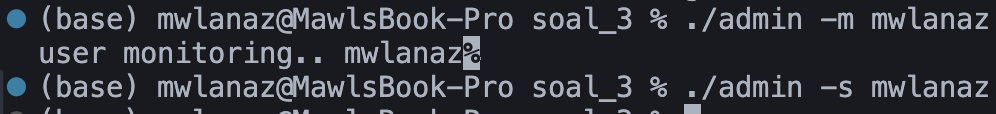
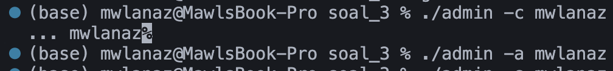
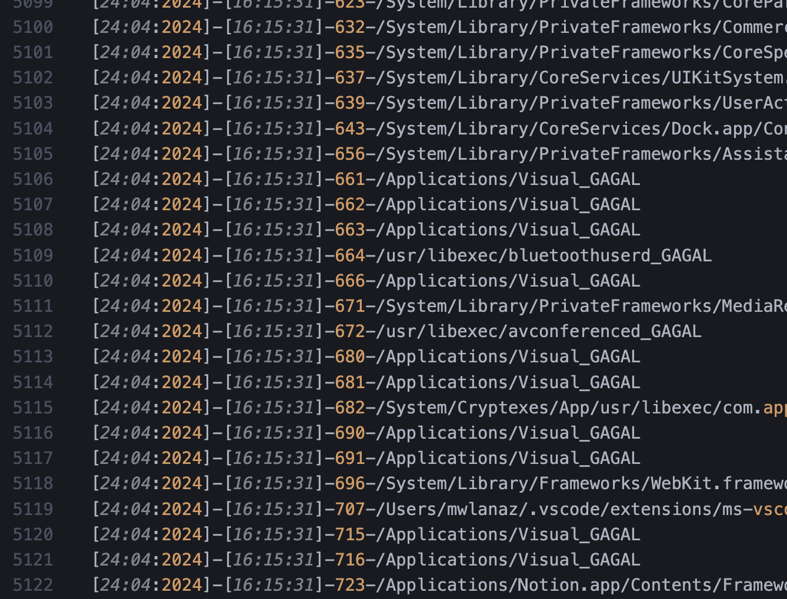

# Laporan Hasil Praktikum Sistem Operasi 2024 Modul 2 - IT02

## Anggota Kelompok IT 02 :

- Maulana Ahmad Zahiri (5027231010)
- Syela Zeruya Tandi Lalong (5027231076)
- Kharisma Fahrun Nisa' (5027231086)

## Daftar Isi

- [Soal 1](#soal-1)
- [Soal 2](#soal-2)
- [Soal 3](#soal-3)
- [Soal 4](#soal-4)

# Soal 1

# Soal 2

# Soal 3

## Deskripsi Soal

Pak Heze adalah seorang admin yang baik. Beliau ingin membuat sebuah program admin yang dapat memantau para pengguna sistemnya. Bantulah Pak Heze untuk membuat program tersebut!

## Pengerjaan

```c
#include <stdio.h>
#include <string.h>
#include <stdlib.h>
#include <unistd.h>
#include <sys/types.h>
#include <sys/stat.h>
#include <fcntl.h>
#include <dirent.h>
#include <signal.h>
#include <sys/wait.h>
#include <pwd.h>
#include <time.h>

```

keterangan :
File ini berisi header yang diperlukan untuk melakukan operasi I/O, manajemen proses, dan manipulasi string dalam bahasa pemrograman C.
stdio.h: Header untuk fungsi standar input-output, termasuk fungsi printf dan scanf.

- string.h: Header untuk fungsi pemrosesan string seperti strcpy, strcat, dan lainnya.
- stdlib.h: Header untuk fungsi umum seperti alokasi memori (malloc), konversi string menjadi angka (atoi), dan fungsi-fungsi lain yang terkait dengan alokasi memori dan manipulasi data.
- unistd.h: Header untuk fungsi-fungsi sistem POSIX seperti fork, exec, dan lainnya.
- sys/types.h: Header yang mendefinisikan tipe data dasar yang digunakan dalam pemrograman sistem, seperti pid_t (untuk ID proses) dan mode_t (untuk mode izin file).
- sys/stat.h: Header untuk fungsi-fungsi yang berkaitan dengan informasi status file, seperti stat dan chmod.
- fcntl.h: Header untuk operasi-operasi file terkait pengendalian akses file dan deskriptor file.
- dirent.h: Header untuk manipulasi direktori seperti membaca isi direktori dengan fungsi opendir dan readdir.
- signal.h: Header untuk menangani sinyal-sinyal yang dikirim ke proses, dengan fungsi-fungsi seperti signal dan kill.
- sys/wait.h: Header yang berisi deklarasi fungsi-fungsi untuk menunggu proses anak selesai dan mendapatkan statusnya.
- pwd.h: Header untuk mendapatkan informasi tentang pengguna saat ini, dengan fungsi seperti getpwuid.
- time.h: Header untuk fungsi-fungsi terkait waktu, seperti time dan localtime.

```c
// Fungsi untuk menampilkan bantuan
void show_help() {
    printf("Usage: ./admin <option> <user>\n");
    printf("Options:\n");
    printf(" -m <user>   Monitor processes for the specified user\n");
    printf(" -s         Stop monitoring processes\n");
    printf(" -c <user>  Continuously fail processes for the specified user\n");
    printf(" -a <user>  Allow processes for the specified user\n");
```

Ini adalah fungsi show_help() yang memberikan panduan penggunaan program. Di sini, program dijelaskan cara menggunakan program admin, termasuk opsi yang tersedia dan argumen yang diperlukan.

Options:

- -m <user>: Memantau proses untuk pengguna tertentu.
- -s: Menghentikan pemantauan proses.
- -c <user>: Terus gagalkan proses untuk pengguna tertentu secara berkelanjutan.
- -a <user>: Memperbolehkan proses untuk pengguna tertentu.

## membuat log dan memonitor log

```c
void monitorProcesses(const char *user) {
    char command[MAX_LINE_LENGTH];
    FILE *ps_output;
    char line[MAX_LINE_LENGTH];
    char log_filename[MAX_LINE_LENGTH];
    FILE *log_file;
    int pid_process;

    snprintf(command, sizeof(command), "ps -u %s -o pid,comm | awk 'NR>1 {print $1, $2}'", user);
    ps_output = popen(command, "r");
    if (ps_output == NULL) {
        perror("Failed to open pipe");
        exit(EXIT_FAILURE);
    }

    snprintf(log_filename, sizeof(log_filename), "%s.log", user);
    log_file = fopen(log_filename, "a");
    if (log_file == NULL) {
        perror("Failed to open log file");
        exit(EXIT_FAILURE);
    }

    pclose(ps_output);
    fclose(log_file);
}
```

Perintah ps digunakan untuk mendapatkan daftar proses untuk pengguna tertentu.
Setiap baris output dari ps diproses untuk mendapatkan PID proses dan nama prosesnya.
Waktu saat ini diambil menggunakan time() dan diubah formatnya menggunakan localtime() dan strftime() untuk mendapatkan timestamp.

## run as daemon

```c
void run_as_daemon() {
    pid_t pid = fork();
    if (pid < 0) {
        perror("fork failed");
        exit(EXIT_FAILURE);
    }
    if (pid > 0) {
        exit(EXIT_SUCCESS);
    }
    if (setsid() < 0) {
        perror("setsid failed");
        exit(EXIT_FAILURE);
    }
    int fd = open("/dev/null", O_RDWR);
    dup2(fd, STDIN_FILENO);
    dup2(fd, STDOUT_FILENO);
    dup2(fd, STDERR_FILENO);
    close(fd);
}
```

Fungsi run_as_daemon membuat program berjalan sebagai daemon dengan cara melakukan fork untuk menciptakan proses anak, kemudian proses induk keluar agar hanya proses anak yang berjalan.

Proses anak kemudian menjadi pemimpin sesi baru dengan `setsid()`, yang memisahkan proses dari terminal kontrolnya.

Selain itu, fungsi ini menutup file descriptor yang terhubung ke terminal dan mengalihkan stdin, stdout, dan stderr ke `/dev/null` untuk membuang input/output, sehingga menjadikan program berjalan sebagai background process yang independen.

## menjalankan program


sebelum melakukan pemanggilan fungsi maka harus dilakukan compile
kemudian setelah itu baru kita dapat melakukan ./admin mwlanaz , dengan mwlanaz merupakan nama dari user yang ingin kita jalani.

`(fungsi menulis ke file log)`

`(fail proccess)`

`(allow proccess)`

`(fungsi main)`

## beberapa error saat menjalankan program

- 
  error saat memasukkan option dikarenakan <'option'> belum terbaca dengan baik oleh fungsi dan belum ditampilkan oleh fungsi main

## revisi

sebelumnya terdapat beberapa kesalahan saat akan melaksanakan eksekusi ./admin <'option'> <'user'> sehingga dilakukan perbaikan pada proses pemonitoran :

```c
    while (fgets(line, sizeof(line), ps_output) != NULL) {
        if (sscanf(line, "%d", &pid_process) != 1) {
            fprintf(stderr, "gagal menjalankan: %s", line);
            continue;
        }

        time_t now;
        struct tm *local_time;
        char timestamp[30];
        time(&now);
        local_time = localtime(&now);
        strftime(timestamp, sizeof(timestamp), "[%d:%m:%Y]-[%H:%M:%S]", local_time);

        fprintf(log_file, "%s-%d-%s_JALAN\n", timestamp, pid_process, line);
    }

```

sehingga saat dilakukan
`(monitor proccess)` maka :



- memasukkkan command `./admin -m mwlanaz` untuk melakukan monitoring
- memasukkkan command `./admin -s mwlanaz` untuk memberhentikan monitoring


program saat memulai monitoring pada ./admin -m mwlanaz pada user mwlanaz, kemudian berhenti saat ./admin -s mwlanaz

kemudian pada soal selanjutnya yakni :

```c
    while (fgets(line, sizeof(line), ps_output) != NULL) {
        if (sscanf(line, "%d", &pid_process) != 1) {
            fprintf(stderr, "gagal menjalankan: %s", line);
            continue;
        }
        time_t now;
        struct tm *local_time;
        char timestamp[30];
        time(&now);
        local_time = localtime(&now);
        strftime(timestamp, sizeof(timestamp), "[%d:%m:%Y]-[%H:%M:%S]", local_time);

        fprintf(log_file, "%s-%d-%s_GAGAL\n", timestamp, pid_process, line);
    }
```



- memasukkkan command `./admin -c mwlanaz` untuk melakukan monitoring GAGAL
- memasukkkan command `./admin -a mwlanaz` untuk memberhentikan monitoring GAGAL



## Soal 4

## Deskripsi Soal

Salomo memiliki passion yang sangat dalam di bidang sistem operasi. Saat ini, dia ingin mengotomasi kegiatan-kegiatan yang ia lakukan agar dapat bekerja secara efisien. Bantulah Salomo untuk membuat program yang dapat mengotomasi kegiatan dia!

## Pengerjaan

```c
#include <stdio.h>
#include <stdlib.h>
#include <string.h>
#include <unistd.h>
#include <signal.h>

#define MAX_APPS 10
#define MAX_NAME_LENGTH 20

// Variabel global untuk menyimpan PID dari setiap proses yang dijalankan
pid_t app_pids[MAX_APPS];
char app_names[MAX_APPS][MAX_NAME_LENGTH]; // Menyimpan nama aplikasi yang dijalankan
int num_apps_running = 0;
```
